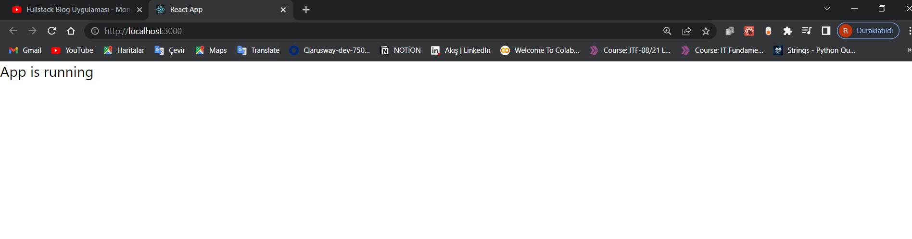

# react-blogApp
client dosyama giriyorum.şimdi burada indirmek istediğim bazı dosyalar var.
mui = react componentleri için oluşturulmuş stil kütüphanesi
redux = veri yönetimi için
react-router-dom = sayfa yönlerdirmek için 
react-hook-form = form işlemleri için
yup = validator
hookform/resolvers = yup resolvere alabilmek için
moment = tarih işlemleri için
axios = http response için veri çekme
react-redux = 
redux-thunk = asecronk işlemleri redux

src dosyamın içindeki gereksiz leri sildim.
## src/App.js
import React from "react";

const App = () => {
  return 
App is running
;
};

export default App;
## src/index.css

* {
  margin: 0;
  padding: 0;
  box-sizing: border-box;
}

body {
  margin: 0;
  font-family: -apple-system, BlinkMacSystemFont, 'Segoe UI', 'Roboto', 'Oxygen',
    'Ubuntu', 'Cantarell', 'Fira Sans', 'Droid Sans', 'Helvetica Neue',
    sans-serif;
  -webkit-font-smoothing: antialiased;
  -moz-osx-font-smoothing: grayscale;
}

code {
  font-family: source-code-pro, Menlo, Monaco, Consolas, 'Courier New',
    monospace;
}

## src/index.js 

import React from "react";
import ReactDOM from "react-dom";
import "./index.css";
import App from "./App";

ReactDOM.render(
  <React.StrictMode>
    <App />
  </React.StrictMode>,
  document.getElementById("root")
);

ekranda düzgünce çalıştığını gördüm