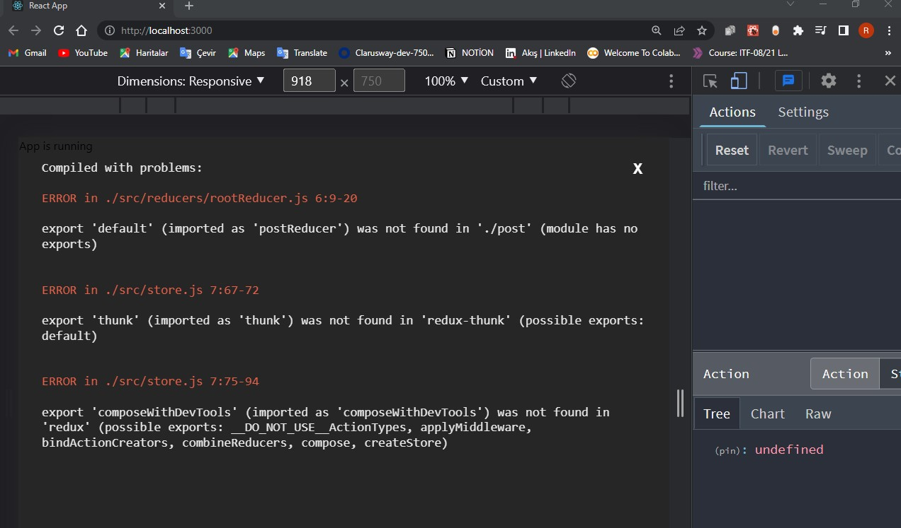
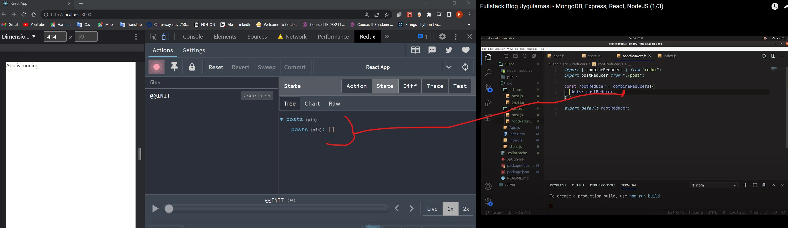

# react-blogApp
client dosyama giriyorum.şimdi burada indirmek istediğim bazı dosyalar var.
mui = react componentleri için oluşturulmuş stil kütüphanesi
redux = veri yönetimi için
react-router-dom = sayfa yönlerdirmek için 
react-hook-form = form işlemleri için
yup = validator
hookform/resolvers = yup resolvere alabilmek için
moment = tarih işlemleri için
axios = http response için veri çekme
react-redux = 
redux-thunk = asecronk işlemleri redux

src dosyamın içindeki gereksiz leri sildim.
## src/App.js
import React from "react";

const App = () => {
  return 
App is running
;
};

export default App;
## src/index.css

* {
  margin: 0;
  padding: 0;
  box-sizing: border-box;
}

body {
  margin: 0;
  font-family: -apple-system, BlinkMacSystemFont, 'Segoe UI', 'Roboto', 'Oxygen',
    'Ubuntu', 'Cantarell', 'Fira Sans', 'Droid Sans', 'Helvetica Neue',
    sans-serif;
  -webkit-font-smoothing: antialiased;
  -moz-osx-font-smoothing: grayscale;
}

code {
  font-family: source-code-pro, Menlo, Monaco, Consolas, 'Courier New',
    monospace;
}

## src/index.js 

import React from "react";
import ReactDOM from "react-dom";
import "./index.css";
import App from "./App";

ReactDOM.render(
  <React.StrictMode>
    <App />
  </React.StrictMode>,
  document.getElementById("root")
);

ekranda düzgünce çalıştığını gördüm.
öncelikle redux için dosya structure oluşturmalıyım
src
|_actions
|_reducers
|_store.js  yapılarını oluşturdum.

öncelikle store.js dosyamı oluşturuyorum.
burada öncelikle gerekli importları gerçekleştirelim

import {createStore, applyMiddleware, compose} from "redux";
                      |_middleWarelerimi eklemek için
import {thunk} from "redux-thunk";
         |_ asecron işlemleri gerçekleştirmek için
import {composeWithDevTools} from "redux";
           |_debug işlemlerini gerçekleştirmek için.

bu paketi yüklemek gerek
npm i --save-dev redux-devtools-extension
son olarakta bir rootReducer yaratcam henuz oluşturmadım

import rootReducer from "./reducers/rootReducer";

src
|_reducers
      |_rootReducer.js

şimdi store.js dosyamın içinde store mı oluşturuyorum.

createStore ile içerisine öncelikle rootReducer ımi geçiyorum.initial state olarak boş bir state yapıyorum.daha sonrasındca ise
compose diyorum ve bunu içerisine applyMiddleware ile thunk ı ekliyorum.middleware ler çok farklı şeyler olabilirler loder, thunk olabilir. eklemek istediğğiniz bir middleeware i applyMiddleware ile ekleyebilirsiniz.bunun dışındada composeWithDevTools() çağırıyorum.
compose un buradaki amacıda iki farklı şeyi çağırmak istediğinizde burada birleştiriyor aslında.

export defaut store;

## src/store.js

import { createStore, applyMiddleware, compose } from "redux";
import { thunk } from "redux-thunk";
import { composeWithDevTools } from "redux";
import rootReducer from "./reducers/rootReducer";

const store = createStore(
  rootReducer,
  {},
  compose(applyMiddleware(thunk), composeWithDevTools())
);

export default store;

şimdide gidelim rootReducer.js içerisinde rootReducerımı oluşturacağım. redux tan combineReducers ı mı import ediyorum.

redux uygulamalarında herbir feature için bir reducer tanımlı oluyor.
postReducer oluşturacağız henuz oluşturmdık bunu postumuzun içinden alıyor olacağız. bunu oluşturalım.
src
|_reducers
      |_ post.js

## src/reducers/rootReducer.js 
import { combineReducers } from "redux";
import postReducer from "./post";

const rootReducer = combineReducers({
  posts: postReducer,
});

export default rootReducer;
 store.js dosyama rootReducer import ediyorum daha önce etmiştim.
 actions dosyamın içinde post actionlarımı oluşturuyor olacağım
types.js diye bir dosya tanımladım.burada action tiplerinin const larını tanımlayacağım.(tiplerimi burada tanımlıyor olacağım). post action createrlarımıda actions/post.js içerisinde tanımlayacağım.burada öncelikle types.js dosyamdaki herşeyi types olarak import ediyorum.
action createrımı oluşturacağım action createrlar action objeleri döndürürler. bir type alanı vardır.ve birde payload alanı vardır.yani veriyi taşıdıkları alan aslında

## actions/types.js 

<export const FETCH_POST = "FETCH_POST";>

## actions/post.js 

<import * as types from "./types";

export const fetchPost = ()=>{
    return{
        type:types.FETCH_POST,
        payload:[]
    }
}>

şimdi reducers directoruma gelelim ve reducerlarımızı create edelim.

reducerlar bir state ve action değeri alıyorlardı ve bunlar action tipine göre,
initialState te göre yeni redux statetini hazırlayıp bize döndüren reducerlardı aslında <reducers/post.js> im,ze gidip buradada <action/types.js> imizdeki bütün typeları import edelim ve aşğıda bir initialState oluşturuyorum
bu bir obje posts:[]deyip boş bir array oluşturuyorum.daha sonra const postReducer diyerek reducerımı oluşturuyorum. ne demiştik bunlar bir initial state ve action alıyorlardı statemın ilk değeri initialStatıme eşit olacak ve bir action alacak daha sonrasında switch ile action type buysa bunu yap buysa bunu yap şeklinde bir yapı oluşturuyorum ve bir case belirtiyorum eğer action typelerinden types.FETCH_POSTS fırlatıldıysa retur diyorum burada yeni stateti döndür.bu alan püre function olması gerekiyor.yani state ti doğrudan değiştirmemem gerekiyor hep bir kopyasını döndürmem gerekiyor. o yüzden ...state (aynısını döndür) değiştirmek istediğim alan posts:[] olduğu için onuda posts:action.payload değeriyle değiştirmek istiyorum sonra default case de ekliyoruz state timde hiçbir değişiklik yapma

## reducers/post.js 

<import * as types from "../actions/types";

const initialState = {
  posts: [],
};

const postReducer = (state = initialState, action) => {
  switch (action.type) {
    case types.FETCH_POST:
      return {
        ...state,
        posts: action.payload,
      };

    default:
      return {
        ...state,
      };
  }
};>

son olarak index.js dosyama gelip bir provider oluşturmam lazım,
"react-redux" kütüphanesinden bir provider import ediyorum.store umuda import ediyorum. provider ımada store isminde bir prop geçiyorum.
çalıştırdığımızda bazı hatalar var. onları düzeltelim

## reducers/ posts.js
export etmeyi unutmuşuz yaptık.

<import * as types from "../actions/types";

const initialState = {
  posts: [],
};

const postReducer = (state = initialState, action) => {
  switch (action.type) {
    case types.FETCH_POST:
      return {
        ...state,
        posts: action.payload,
      };

    default:
      return {
        ...state,
      };
  }
};

export default postReducer;>

store. js deki hatalarımızıda düzeltik:
## src/store.js 

<import { createStore, applyMiddleware, compose } from "redux";
import thunk  from "redux-thunk";
import { composeWithDevTools } from "redux-devtools-extension";
import rootReducer from "./reducers/rootReducer";

const store = createStore(
  rootReducer,
  {},
  compose(applyMiddleware(thunk), composeWithDevTools())
);

export default store;
>

 uygulammızın ara yüzünü oluşturmaya başlayalım:
 <https://mui.com/components/typography/#roboto-font-cdn> cidesinden mui roboto font linkini kopyalayıp public/index.html ilgil yere kopyaladım.

 öncelikle app.js dosyamın içerisine geliyorum.mui den bazı importları gerçekleştireceğim.
 import * as React from "react";
import AppBar from "@mui/material/AppBar";
import Toolbar from "@mui/material/Toolbar";
import Typography from "@mui/material/Typography";
import Button from "@mui/material/Button";
import IconButton from "@mui/material/IconButton";
import MenuIcon from "@mui/icons-material/Menu";
import CssBaseline from "@mui/material/CssBaseline";
import BorderColorSharpIcon from "@mui/icons-material/BorderColorSharp";

## App.js

const App = () => {
  return (
    <>
      <CssBaseline />

      <AppBar position="static">
        <Toolbar>
          <IconButton
            size="large"
            edge="start"
            color="inherit"
            aria-label="menu"
            sx={{ mr: 1 }}
          ></IconButton>
          <Typography variant="h6" color="secondary" sx={{ flexGrow: 3 }}>
            <a href="http://localhost:3000/posts" color="secondary">Blogfy</a>
          </Typography>
          <Button color="inherit">{<BorderColorSharpIcon />} yeni yazı</Button>
        </Toolbar>
      </AppBar>
    </>
  );
};

export default App;

 şimdi, Router yapısını oluşturalım:
 ## App.js 

 import * as React from "react";

import AppBar from "@mui/material/AppBar";
import Toolbar from "@mui/material/Toolbar";
import Typography from "@mui/material/Typography";
import Button from "@mui/material/Button";
import IconButton from "@mui/material/IconButton";
import CssBaseline from "@mui/material/CssBaseline";
import BorderColorSharpIcon from "@mui/icons-material/BorderColorSharp";
import Grid from "@mui/material/Grid";
import {
  BrowserRouter as Router,
  Switch,
  Route,
  Redirect,
} from "react-router-dom";
import PostList from "./components/PostList";

const App = () => {
  return (
    <>
      <CssBaseline />

      <AppBar position="static">
        <Toolbar>
          <IconButton
            size="large"
            edge="start"
            color="inherit"
            aria-label="menu"
            sx={{ mr: 1 }}
          ></IconButton>
          <Typography variant="h6" color="secondary" sx={{ flexGrow: 3 }}>
            <a href="http://localhost:3000/posts" color="secondary">
              Blogfy
            </a>
          </Typography>
          <Button color="inherit">{<BorderColorSharpIcon />} yeni yazı</Button>
        </Toolbar>
      </AppBar>
      <Grid item xs={12}>
        <Router>
          <Switch>
            <Route exact path="/posts" component={PostList}></Route>
          </Switch>

          <Redirect from="/" to="/posts" />
        </Router>
      </Grid>
    </>
  );
};

export default App;
